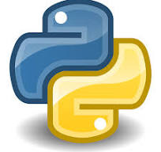
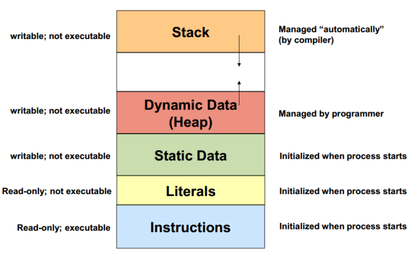
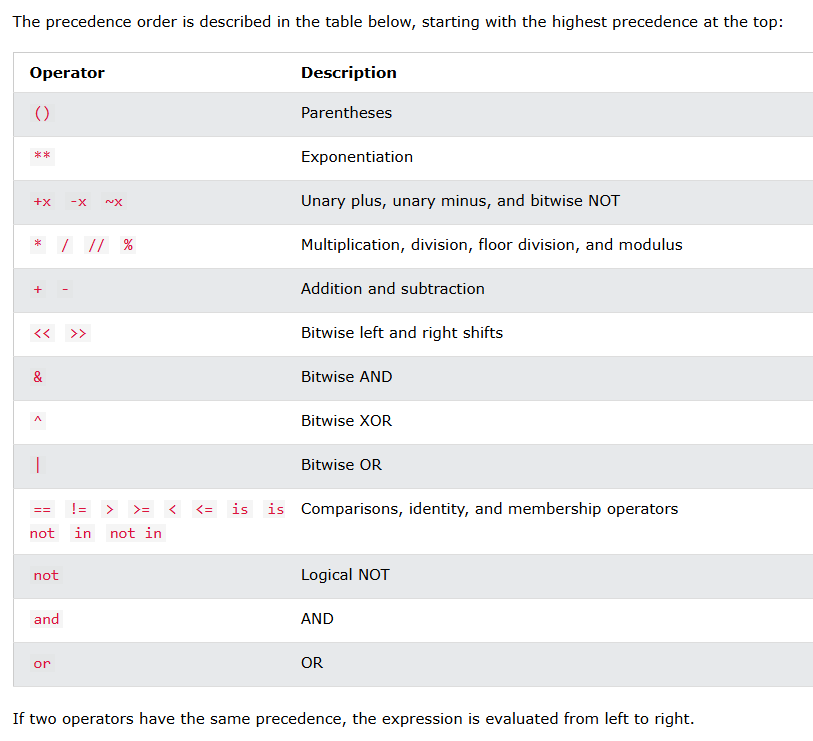

# Python Programming
## - Dr. Debayan Ganguly
------------------------------------------------------------
- Intro to OOPs
- DS in Python
- Files
- Numpy, Pandas, Matplotlib(Seaborn)
- Scipy
- Stat with Excel

------------------------------------------------------------

# 🔰 MASTER LIST OF TOPICS
### ✅ BASICS
- How a Number is Stored in System (including +ve and -ve)0
- Introduction to Python
- Python Virtual Machine (PVM)
- Memory Management in Python
- Automatic Garbage Collection
- Complexities of Algorithms

### ✅ CORE PYTHON
- Data Types in Python (Built-in & User-defined)
- Mapping Types (like dict)
- Operators
- Operator Precedence
- Math Module (methods)

### ✅ FLOW CONTROL
- Control Statements (if, else, etc.)
- Loops (for, while)
- Functions (Normal)
- Anonymous Functions (lambda)
    - filter()
    - map()
    - reduce()
- One-Line Codes (control, loops, lambda)
- Recursion (Types):
    - Direct
    - Indirect
    - Tail
    - Nested

### ✅ DATA STRUCTURES
- Storage & Access Strategies
- Linear Structures:
- Array (Searching & Sorting)
- Types of Sorting (Bubble, Insertion, Merge, etc.)

### ✅ OBJECT ORIENTED PROGRAMMING
- Class & Object
- Constructor
- Encapsulation
- Abstraction
- Inheritance
- Polymorphism

### ✅ LIBRARIES
- NumPy (Basics, Operations, Applications)

-------------------------------------------------------------------------

## How a Number is stored in System (-ve Value)
- -ve no stored in 2's Complement format.
- We dont have any physical device which can work on more than two states hence we still use computers on Binary scale (1951 - 2025 -> Transistor -> 0/1)

- Example :
```sh
float x = 0.7
if (x == 0.7)
    print('A')
else
    print('B')
===> B (float 0.7000000008 != 0.7)

// Rounding off the numbers 
double x = 0.7
if (x == 0.7)
    print('A')
else
    print('B')
===> A ()
```

- Every operation is basically "ADDITION".

- Machine Level Language [BINARY (0/1)] > ASSEMBLY LEVEL CODE (Instruction Set) > High Level Language [C, C++, Java, Python]  
-----------------------------------------------

## Introduction to Python



- Python -> Guido Van Rossum (1991) 

- Features :
  1. Simple
  2. Easy to Learn
  3. Open Source
  4. High Level Language
  5. Dynamically Typed
  6. Platform Independent
  7. Procedure OP + OOP
  8. Interpreted (Python Code > Intermediate (Byte code) > (-> PVM) Machine Code)
  9. Extensible
  10. Huge Library
  11. Scripting Language
  12. DataBase Connectivity
  13. Scalable
  14. Batteries Included (argparse, boto, CherryPy, Cryptography, Fiona, Jellyfish) -[A wide range of built-in modules and functionalities without requiring users to download separate packages.]


### Python Virtual Machine (PVM)
- Referred to as Python Interpreter
- "JUST IN TIME COMPILER" - JIT Converts byte code into machine code but faster than the interpreter.
- Its advantage is to improve the speed of execution of a python program to get executed.
- JIT compiler is not availabe in all python env.

### Memory Management in Python
- In python, memore allocation and deallocation are done during runtime automatically. -> Automatic Garbage Collection
- All these objects are stored on a seperate memory called HEAP.



```text
+----------------------------+
|        Python App         |
+----------------------------+
           |
           v
+----------------------------+
|    Memory Manager (C API) |
+----------------------------+
           |
           v
+-----------------------------+
|  Stack Memory      |        |
|--------------------|        |
| Function Calls     |        |
| Local Variables    |        |
+--------------------+  Heap  |
|                      Memory|
|  Object Storage (List, Dict)|
|  Class Instances, etc.      |
|                             |
+-----------------------------+
           |
           v
+-----------------------------+
| Reference Counting Engine   |
|   +                         |
| Garbage Collector (Cycle)   |
+-----------------------------+
```


- 64-bit processing (Windows) - 64 bit Data in a Single Clock cycle. (64 Parallel Lines for Processing).


### *Complexity of Algorithm*
1. Time Complexity
2. Space Complexity

- Goal is to compare algorithms (or Solution) based on running time but also some other factors (Memory management).
  - To compare Algorithms
  - Execution Time
  - No of Statements executed ?
  - Ideal Solution ?


## Data Types in Python

### Comments 
1. Single line comment (#)
2. Multi Line Commnet 
```text
    (``` Line 1 Statement
        line 2 Statement ```)
```

### Datatypes :
- **How Python Sees Variables** : In Python, A variable is seen as a tag or name that is tied to some value.
- In Java and C if x = 2 and y = 2, there will be two different value alloted to different locations.
- But in Python if x = 2 and y - 2, these will be only one location of 2 which be pointed by both x and y tags.
```sh
// C code
#include<stdio.h>
int main(){
    int a = 10, b=10;
    printf("%u",a);
    printf("%u",a);

    return 0;
}

a and b will have different values.

# Python Code
x = 10
y = 10
print(id(x))
print(id(x))
->
140735251221208
140735251221208
```

### ASCII values : (Americn Standard Code for Information Exchange)

- Full ASCII Table (0–127)

| Dec | Char/Name       | Dec | Char/Name       | Dec | Char/Name       | Dec | Char/Name       |
|-----|------------------|-----|------------------|-----|------------------|-----|------------------|
|  0  | NUL (Null)       |  1  | SOH (Start of Heading) |  2  | STX (Start of Text) |  3  | ETX (End of Text) |
|  4  | EOT (End of Transmission) |  5  | ENQ (Enquiry)    |  6  | ACK (Acknowledge) |  7  | BEL (Bell)        |
|  8  | BS  (Backspace)  |  9  | TAB (Horizontal Tab) | 10  | LF  (Line Feed)   | 11  | VT  (Vertical Tab) |
| 12  | FF  (Form Feed)  | 13  | CR  (Carriage Return) | 14  | SO  (Shift Out)  | 15  | SI  (Shift In)     |
| 16  | DLE (Data Link Escape) | 17  | DC1 (Device Ctrl 1) | 18  | DC2 (Device Ctrl 2) | 19  | DC3 (Device Ctrl 3) |
| 20  | DC4 (Device Ctrl 4) | 21  | NAK (Negative Ack) | 22  | SYN (Synchronous Idle) | 23  | ETB (End of Block) |
| 24  | CAN (Cancel)     | 25  | EM  (End of Medium) | 26  | SUB (Substitute) | 27  | ESC (Escape)       |
| 28  | FS  (File Separator) | 29  | GS  (Group Separator) | 30  | RS  (Record Separator) | 31  | US  (Unit Separator) |
| 32  | ␣ (Space)        | 33  | !                | 34  | "                | 35  | #                |
| 36  | $                | 37  | %                | 38  | &                | 39  | '                |
| 40  | (                | 41  | )                | 42  | *                | 43  | +                |
| 44  | ,                | 45  | -                | 46  | .                | 47  | /                |
| 48  | 0                | 49  | 1                | 50  | 2                | 51  | 3                |
| 52  | 4                | 53  | 5                | 54  | 6                | 55  | 7                |
| 56  | 8                | 57  | 9                | 58  | :                | 59  | ;                |
| 60  | <                | 61  | =                | 62  | >                | 63  | ?                |
| 64  | @                | 65  | A                | 66  | B                | 67  | C                |
| 68  | D                | 69  | E                | 70  | F                | 71  | G                |
| 72  | H                | 73  | I                | 74  | J                | 75  | K                |
| 76  | L                | 77  | M                | 78  | N                | 79  | O                |
| 80  | P                | 81  | Q                | 82  | R                | 83  | S                |
| 84  | T                | 85  | U                | 86  | V                | 87  | W                |
| 88  | X                | 89  | Y                | 90  | Z                | 91  | [                |
| 92  | \                | 93  | ]                | 94  | ^                | 95  | _                |
| 96  | `                | 97  | a                | 98  | b                | 99  | c                |
|100  | d                |101  | e                |102  | f                |103  | g                |
|104  | h                |105  | i                |106  | j                |107  | k                |
|108  | l                |109  | m                |110  | n                |111  | o                |
|112  | p                |113  | q                |114  | r                |115  | s                |
|116  | t                |117  | u                |118  | v                |119  | w                |
|120  | x                |121  | y                |122  | z                |123  | {                |
|124  | \|               |125  | }                |126  | ~                |127  | DEL (Delete)     |


#### Built-in Datatypes :
   1. None Type - object with no object value 'None' - In boolean 'None' datatype represents 'False'.
   2. Numeric Type - Integer(-50, 0, 678999), Float(0.5, -3.456, 0.001, 2.5e4), Complex(a+bj) - (Commonly used in Quantum Computing) - (2+3i)
   3. Bool - (True or False)
   4. Sequences - 
      1. String(str) :
           - Group of Characters enclosed in Quotes -> " - " or ' - ' .
           - Triple Qoutes for String inside a string.
           - ':' colon can be used for String Slicing.
      2. Bytes - 
      3. ByteArray - Similar to byte, but ByteArray can me modified.
      4. List : [ ]
           - Same as Array in other language, but need not to be Homogeneous. 
           - x = [1,2,3,4,5], students = ["Mahesh","Chetan","Mansi"]
           - Also has -ve indexing so that list can be accessed from other end too. 
           - Multi-Dimensional List is nothing but Nested List. 
           - ':' colon can be used for List Slicing.
      5. Tuple : ( )
        - Elements separated by commas
        - Immutable
        - ':' colon can be used for List Slicing.
      6. Range : 
        - Represents a sequence of numbers.
        - **range(start, end, increment/decrement)**
   5. Sets : { }
      - Unordered collection of elements, can not be indexed which makes it difficult to access the particular element.
      - Does not accept duplicate elements
      - Set vs Frozenset : Set can be modified but other one cannot.
   6. Mapping : (Dictionary) 
        - Key and Value pairs.
        - Eg. Dictionary -> D = {1 : 'One', 2 : 'Two'} 

- char ch; -> 1 Byte -> 8 bits -> 0 to (2^n)-1 -> 0 to [(2^6)-1] = 255 -> -128 to 127 (Range)
- unsigned int > 0 to 4,294,967,295
- int > -2,147,483,648 to 2,147,483,647

##### **NOTE :** Return type of printf() in C programming
```sh


// 01
#include <stdio.h>
int main() {
    printf("%d",printf("Jio"));
    return 0;
}
Op -> Jio3


// 02
#include <stdio.h>
int main() {
    int a;
    a = printf("Jio %d Institute",printf("Mumbai"));
    printf("\n%d",a);
    return 0;
}
Op ->
MumbaiJio 6 Institute
15

// 03
#include <stdio.h>
int main() {
    if(printf("JIO")){}
    return 0;
}
Op -> JIO
```

### Operators :
| Operators                                               | Notations                           |
|---------------------------------------------------------|-------------------------------------|
| Arithmetic Operators                                    | + , - , * , / , // , % , **         | 
| Unary Minus Operator                                    | - (To negate someting)              |
| Assignment Operators                                    | = , += , -= , *= ,  /= , //=        | 
| Relational Operators                                    | == , != , < , > , <= , >=           |
| Logical Operators                                       | and , or , not                      |
| Bitwise Operators                                       | & (Bitwise AND) , \| (Bitwise OR), ^ (Exclusive OR), ~ (One's Complement), <<(Left Shift), >>(Right Shift) |
| Membership Operators (To Test for Membership )          | in , not in                         | 
| Identity Operator                                       | is , is not                         |


| Integer 1 | Integer 2 |  AND (&)  |  OR (\|)  |   XOR(^)  |
|-----------|-----------|-----------|-----------|-----------|
|     0     |     0     |     0     |     0     |     1     |
|     0     |     1     |     0     |     1     |     0     |
|     1     |     0     |     0     |     1     |     0     |
|     1     |     1     |     1     |     1     |     1     |


### Math module
- Module to do some basic mathematical calculations.


## Control Statements
### IF - ELSE Statements :
1. IF :
```sh
if(condition) :
    statement
```
2. IF - ELSE :
```sh
if(condition) :
    statement
else:
    statement
```
3. IF - ELIF - ELSE :
```sh
if(condition) :
    statement
elif(condition):
    statement    
else:
    statement
```
4. Nested IF-ELSE :
```sh
if(condition) :
    if(condition) :
        statement
    else:
    statement
else:
    statement
```

### While Loop :
```sh
while(condition):
    Statement
```

### For Loop :
```sh
for 'initial-value' in range(start,end,difference):
    Statement
```

### assert statement


## Functions :
- A set of statements that take inputs to do some task.
- Method (Function which is part of a class).
- Function (which is not the part of any class).
- To define a function use '**def** function_name'.
- Lambdo forms can take any no of arguments but can return on one value in the form of expressions.

### Anonymous Function : 
- Function without name.
- Normal Function
- 'lambda' keyword is used.
```sh
cube = lambda x : x*x*x
print(cube(7))

Op -> 343
```

- Lambda with filter() function :
- filter(function, sequence)
```sh
# filter()

lst = [10,23,45,67,88,90]

lst1 = lst(filter(lambda x : (x%2==0), lst))
print(lst1)


Op -> [23,45,67]
```
- Lambda with map() function

```sh
numbers = [1,2,3,4,5]
sq_num = list(map(lambda x:x*x, numbers))
print(sq_num)

Op -> [1,4,9,16,25]
```

```sh
lst1 = [1,2,3,4,5]
lst2 = [10,20,30,40,50]
lst3 = list(map(lambda x,y:x*y, lst1, lst2))
print(lst3)

Op - > [10,40,90,160,250]
```


- Lambda with reduce() function
```sh
from funtools import reduce
lst = [1,2,3,4,5]
s = reduce(lambda x,y : x*y, lst)
print(s)

Op -> 120
```

```sh
from functools import reduce
sum = reduce(lambda a,b : a+b, range(1,51))
print(sum)


Op -> 1275
```


### Recursion :
- Recurssion is a process in which a process is defined in terms of itself.
- A recursive function is a function that calls itself.
- Every recurrsion function works in two phases.
    1. Winding Phase : Phase begins when the recurssion function is called for the first time and each recursive call continues the winding phase.The Phase terminated when the terminating condition becomes True.
    2. Unwinding phase : Begins and all the recursive function call starts returning in reverse order. Till the first
- Recursion is comparatiely slower than Iterative approach.
- 

```sh
# Iteration Method
n = 5
fact = 1
for i in range(1, n+1):
    fact *= i
print(fact)

# Recurssion Method
def fact(x):
    if (x==0):
        return 1
    else:
        return x*fact(x-1)
    
print(fact(5))
```

- Types of Recurssion : (4 Types)
  1. Tail Recurssion : 
     - In the program very last statement is recursive call and there is no other statement after that.
     - It will occur when the recurssive call is the last operation in the function.
```sh
def fact_tail(n, fact=1):
    if (n==0):
        return fact
    else:
        return fact_tail(n-1, n*fact)

print(fact_tail(5))
```
  2. Indirect Recursion :
     - Two or more function calling each others is called as Indirect Recursive

#### Nested Recursion :
- Recursive Function which is passing itself as parameter to a recursive call.  

### Arguments :
1. Variable number of Arguments : Incase you dont know the exact number of arguments, you can use - (*args) [args = variable_name]


## Data Structure : (Storage and Access strategies of Data.)

### Linear DS :
1. Array :- 
   - Stores Homogeneous data elements in continguous memory location.  
   - A = [10,20,30,40]
   - Issue : To Add any value in between we have to shift the existing elements to either side.
   - Advantages : Accessibility - O(1)
   - Functions : 
     - Add Element : insert(), append()
     - Access Element : a[i], slicing
     - Remove Element : remove(), pop()
```sh
import array as arr
a = arr.array('i',[1,2,3])
```


#### Searching :
1. Linear Search - O(n)
2. Binary Search - O(log n)
3. Interpolation Search - O(log log n)

#### Sorting :
1. Comparision Sorts :
   1. Bubble Sort - O(n^2)
   2. Insertion Sort - O(n^2)
   3. Selection Sort - O(n^2)
   4. Quick Sort - O(n^2)
   5. Merge Sort - O(nlogn)
   6. Heap Sort - O(nlogn)
2. Non-Comparision Sorts :
   1. Radix Sort - O(n) -> Digit vise sorting (unit - tens - hundreds - ....)
   2. Count Sort - O(n) 
   3. Bucket Sort - O(n)

- Stable and Unstable Sort :
    - [1,2(a),3,4,2(b),5] => Sorting =>  [1,2(b),2(a),3,4,5]  { Unstable Sort }


## OOPs - Object Oriented Programming Language
- Python partially follows both OOPs and Procedure OPs
- Problems with Procedure Oriented Approach :
    1. There is no reusability of existing code.
    2. Debugging or removing error will become difficult.
- In OOPs, everything is an Object.

- Features of OOPs:
    1. Class and Objects
    2. Encapsulation
    3. Abstraction
    4. Inheritance
    5. Polymorphism


1. Class and Object :
    - An Object is anything that really exists in the world and can be distinguished from others
    - Class represents common behaviour of a group of objects.
    - It has no physical memory.
    - Every class has some attributes and 
```sh
class : Person
Attributes : name, age, sex
Action : Talking, Walking, Eating


Object : Sam
Attributes : Suyash, 23, Male
Action : Sleeping, Playing
```

2. Encapsulation :
    - Mechanism where data (variables) and the code(methods) that are online data, Bind together.
    - The Variables and Methods of a class are called Members of the classes. 
    - All the members of a class are by default available outside the class. 
    - They are public by default. 
    - Python follows uniform access principle.
```sh
class Student:
    def __init__(self):  
        self.id = 10
        self.name = "Sam"
    def display(self):
        print(self.id)
        print(self.name)
```
- def _ _ init _ _(self) -> Declare and Initiliaze the instance variable of a class. -> Are Variables whose copy is available  in the object (or instance)


3. Abstraction :
    - We can hide unnecessary data from user and expose only that data that is of interest to the user.


4. Inheritance :
    - New/Child class can access all properties/methods of existing/parent class.

5. Polymorphism :
    - Poly = Multiple & Morph = Forms
    - Same name but different functions/tasks due to different number of parameters.

### Constructor :
- Special method used to initialize the instance variables of a class.
- The first parameter of the constructor that will be 'Self' variable that contains the memory address of the Instance.


# Python Libraries :

## Numpy (Numerical Python) - Numerical Analysis
- Effecient interface to store and analyse dense data buffers.
- 


------------------------------------------

## Rough Work :)
---> (2's Complement, Number System Conversions, Functional Programming, Complexity Calculations, XOR Gate (search duplicate value in array), Bitwise Operators, Bit shifting, )

==== (Keyboard -> Below every key a Decoder Circuit, press the key, decoder converts the ASCII Value to Binary, Binary data sent to Processor)

### 1's & 2's Complement : 

- **Why ?** :
- Earlier negative and positive numbers were represented by signed bits

| Decimal Number | Binary (Unsigned) | Signed Magnitude | 1's Complement | 2's Complement |
|----------------|-------------------|------------------|----------------|----------------|
| -9             | -                 | -                | -              | -              |
| -8             | -                 | -                | -              | -              |
| -7             | -                 | 1111             | 1111           | 1001           |
| -6             | -                 | 1110             | 1110           | 1010           |
| -5             | -                 | 1101             | 1101           | 1011           |
| -4             | -                 | 1100             | 1100           | 1100           |
| -3             | -                 | 1011             | 1011           | 1101           |
| -2             | -                 | 1010             | 1010           | 1110           |
| -1             | -                 | 1001             | 1001           | 1111           |
| -0             | -                 | 1000             | 1111           | -              |
| +0             | 0000              | 0000             | 0000           | 0000           |
| 1              | 0001              | 0001             | 0001           | 0001           |
| 2              | 0010              | 0010             | 0010           | 0010           |
| 3              | 0011              | 0011             | 0011           | 0011           |
| 4              | 0100              | 0100             | 0100           | 0100           |
| 5              | 0101              | 0101             | 0101           | 0101           |
| 6              | 0110              | 0110             | 0110           | 0110           |
| 7              | 0111              | 0111             | 0111           | 0111           |
| 8              | 1000              | -                | -              | -              |
| 9              | 1001              | -                | -              | -              |

- As per above table,
- It is a method used to represent signed integers (+ve, -ve and 0) in binary.
- 
